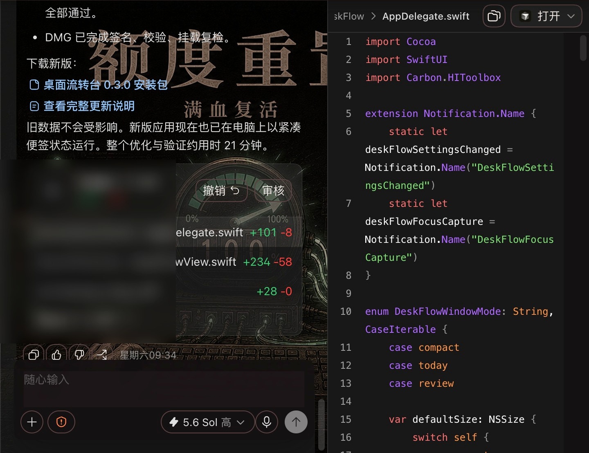
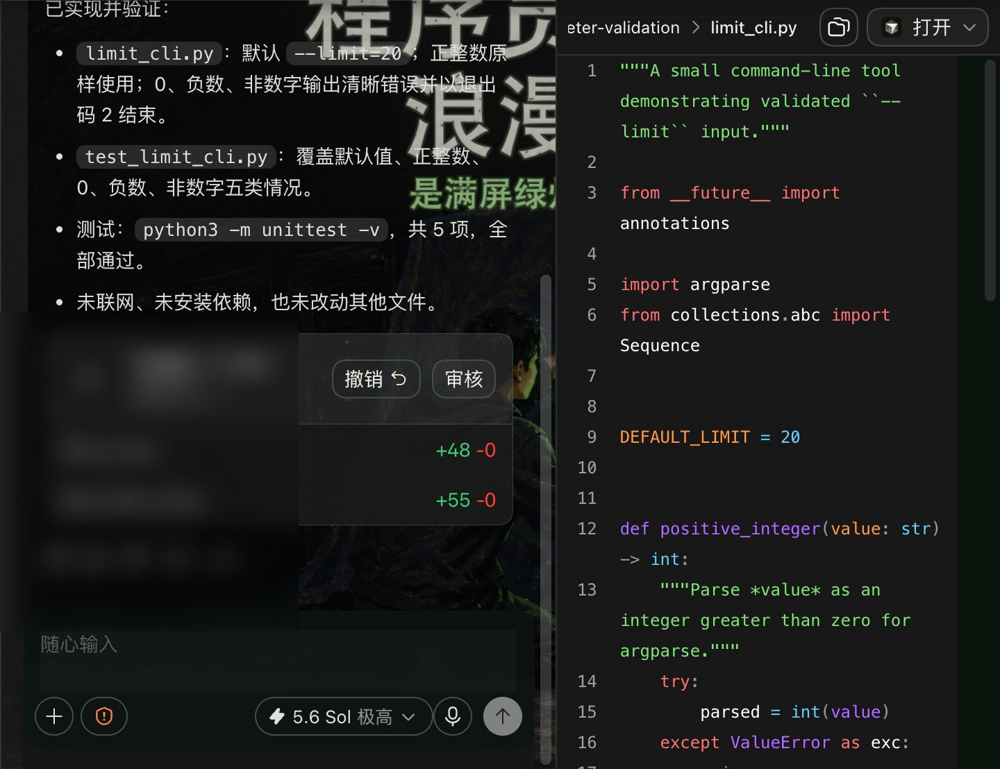
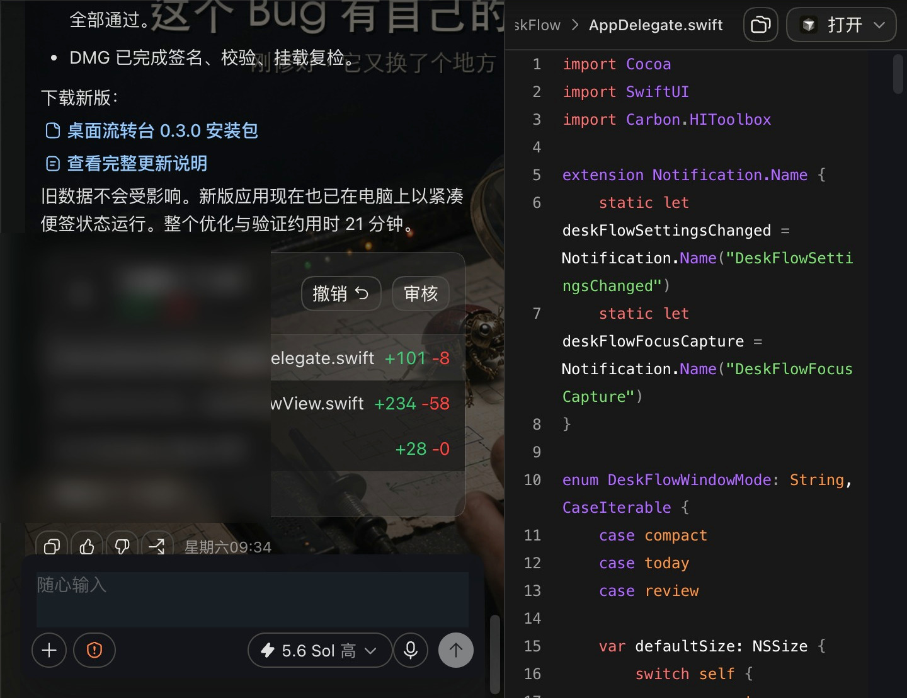

# Codex 皮肤工坊

**原作与优化**

原始应用由毕方团队同事开发；Lydia 负责后续功能优化和皮肤内容整理。原始开发者与优化贡献分别署名。

我平时用 Codex 写代码，在同事开发的皮肤工坊基础上做了功能优化，并整理与扩充了数百款皮肤。做它不是为了再放一组背景图，而是因为有两件事挺影响使用：

- 点了“应用”，界面有时还是原样；
- 皮肤一多，预览和 Codex 同时开着，内存会慢慢往上爬。

我现在的处理方式很简单：正在用的皮肤才放进运行目录，其他的需要时再读；重复点“应用”不会一层层叠样式；切换以后会再看一眼 Codex 界面，确认它是真的变了。

下面三张图，都是把皮肤套到 Codex 之后截的。任务结果、改动文件、代码和测试还在画面里，不是单独做出来的效果图。

完整主题放在爱发电：<https://ifdian.net/a/lydiahub2026>

这里的仓库只放真实界面和说明，不放飞书公共文件夹、整包 ZIP 或网盘直链。
